# Distribution générée — grille (nombre de couches K) x (nombre de features / dual_dim)

Comparaison croisée des distributions générées (epoch 50, nuage de points généré superposé à la cible 2-moons) en faisant varier le nombre de couches `K` (lignes) et la dimension des features / variable duale `dual_dim` (colonnes), pour chaque combinaison modèle x version (prox L1). Données issues de `results_2moons_DFB_ScCP_L1` (étude "normale", source = 8 gaussiennes) et `results_2moons_DFB_ScCP_L1_small` (étude "small", source = gaussienne standard).

Seules les cases correspondant à une expérience réellement lancée sont remplies (les deux études forment chacune une croix dans l'espace (K, dual_dim), pas une grille complète) — les cases vides (`—`) n'ont pas été testées.

## DFB — LFO

| K \ dual_dim | 4 | 8 | 16 | 32 | 64 |
|---|---|---|---|---|---|
| **K=1** | — | — | 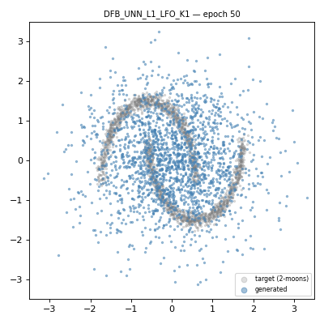 | — | — |
| **K=3** | 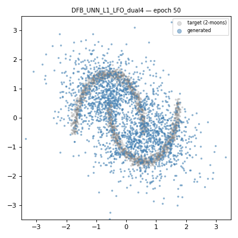 | 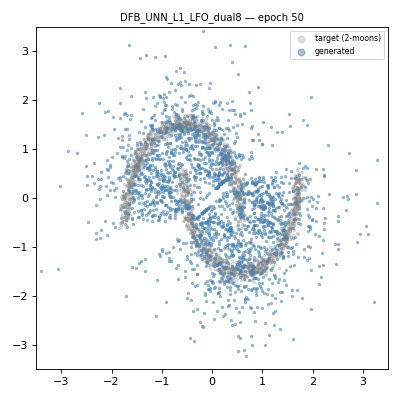 | 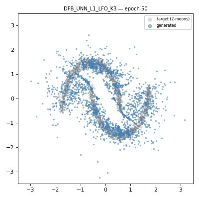 | — | — |
| **K=5** | — | — | 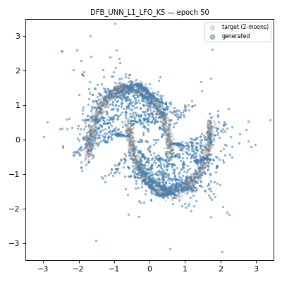 | 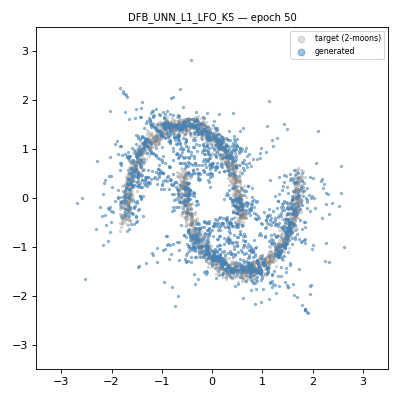 | — |
| **K=10** | — | — | 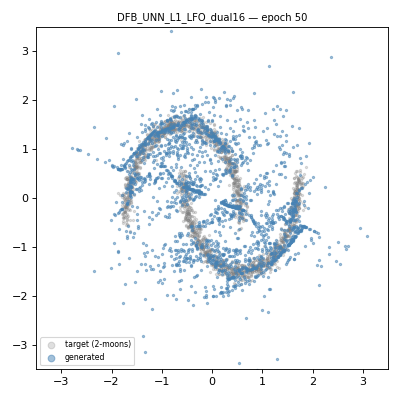 | 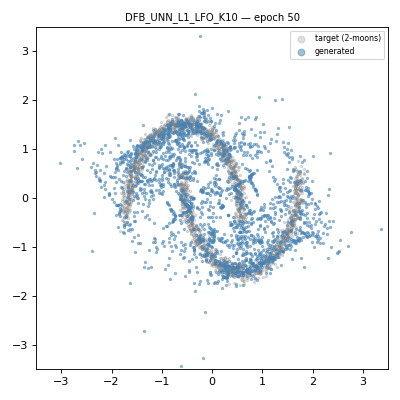 | 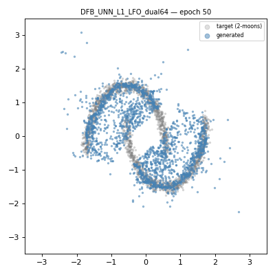 |
| **K=15** | — | — | — | 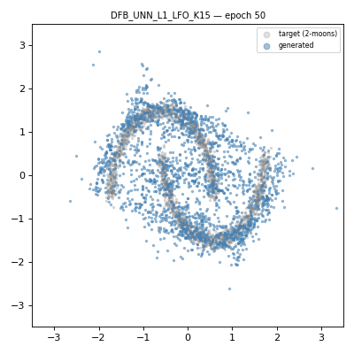 | — |

## DFB — LNO

| K \ dual_dim | 4 | 8 | 16 | 32 | 64 |
|---|---|---|---|---|---|
| **K=1** | — | — | 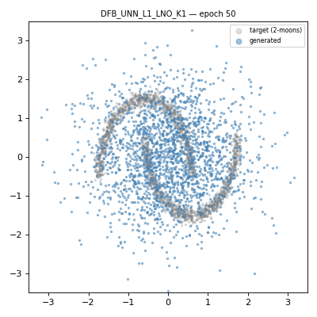 | — | — |
| **K=3** | 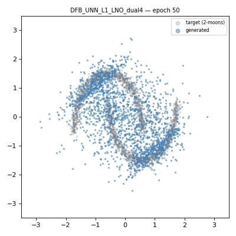 | 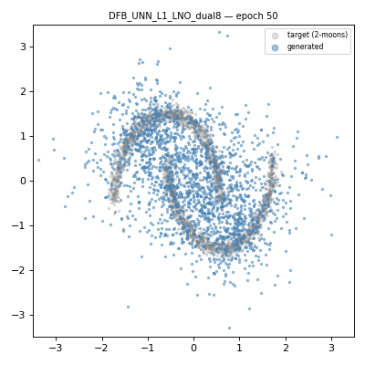 | 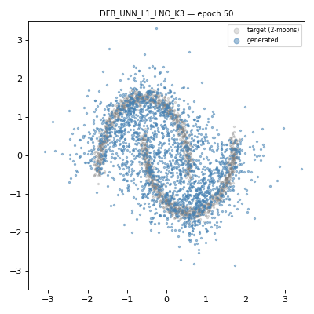 | — | — |
| **K=5** | — | — | 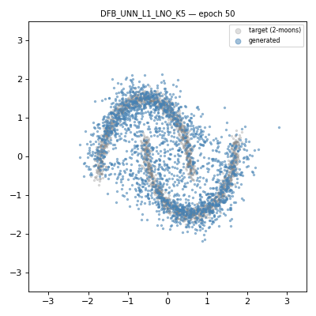 | 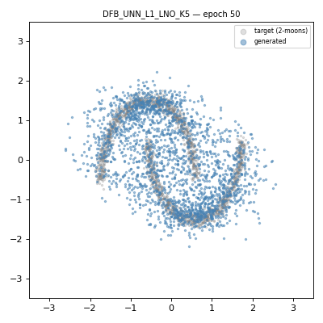 | — |
| **K=10** | — | — |  | 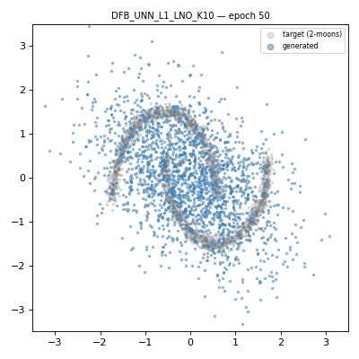 | 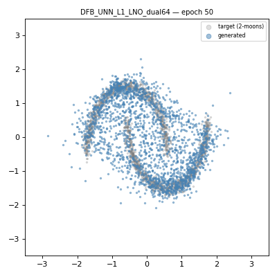 |
| **K=15** | — | — | — | 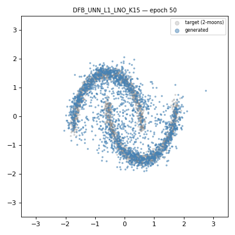 | — |

## ScCP — LFO

| K \ dual_dim | 4 | 8 | 16 | 32 | 64 |
|---|---|---|---|---|---|
| **K=1** | — | — | 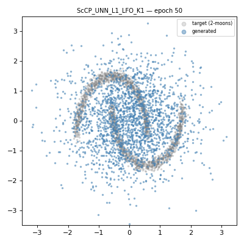 | — | — |
| **K=3** | 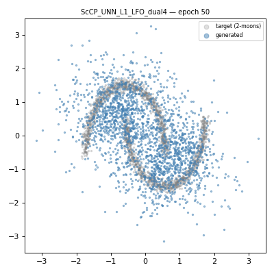 | 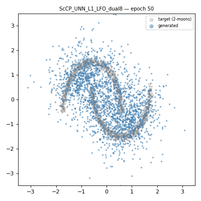 | 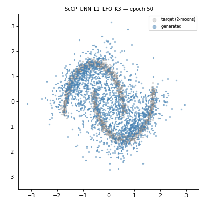 | — | — |
| **K=5** | — | — | 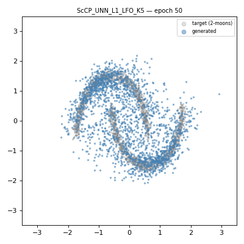 |  | — |
| **K=10** | — | — | 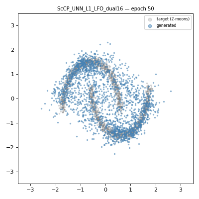 | 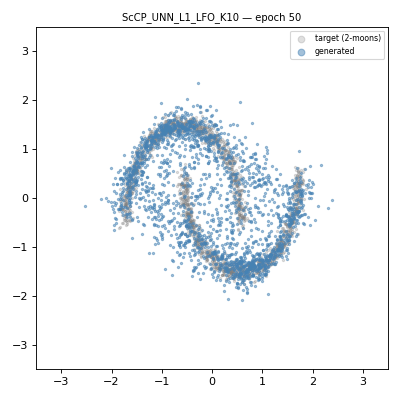 | 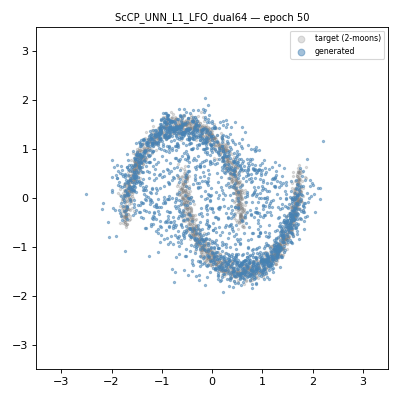 |
| **K=15** | — | — | — | 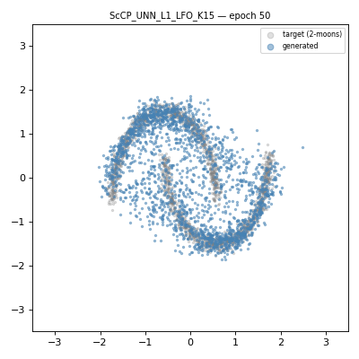 | — |

## ScCP — LNO

| K \ dual_dim | 4 | 8 | 16 | 32 | 64 |
|---|---|---|---|---|---|
| **K=1** | — | — | 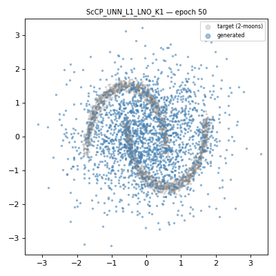 | — | — |
| **K=3** |  | 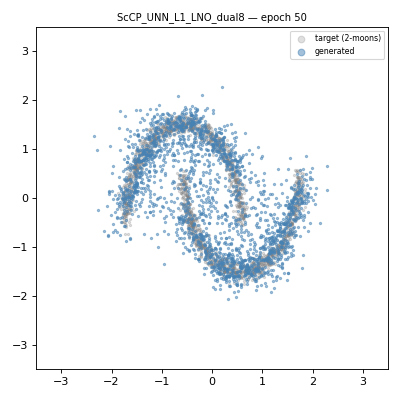 | 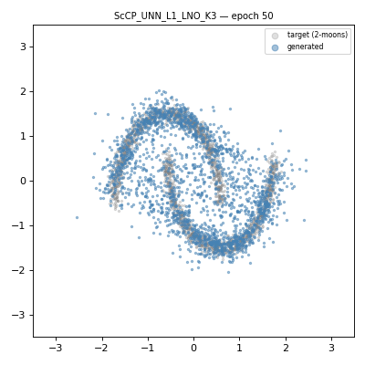 | — | — |
| **K=5** | — | — |  | 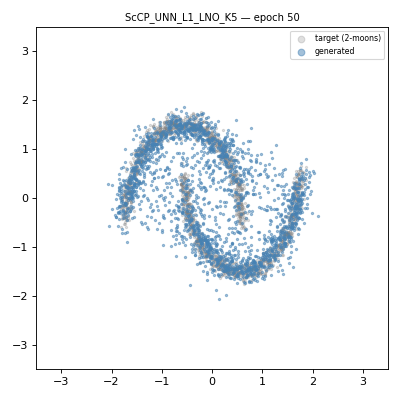 | — |
| **K=10** | — | — | 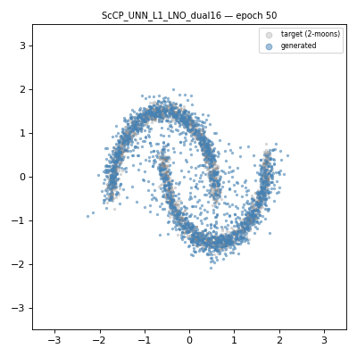 |  | 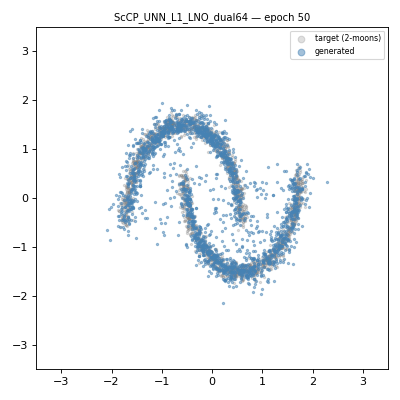 |
| **K=15** | — | — | — | 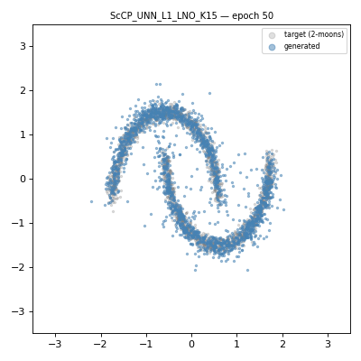 | — |
